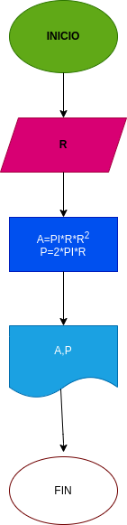

# LENGUAJE MARKDOWN

##  calcular  el area y el perimetro de un circulo de radio R.

# ANALISIS

Variables de entrada

R: Radio del circulo

Variables de procesaso y salida (processing , storage, output)

Area del circulo
P:Perimetro del circulo

# DISEÑO

## Este archivo esta escrito en lenguaje Markdown

